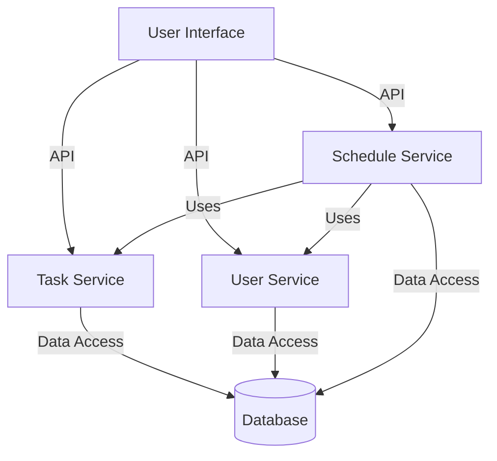

# System Architecture

```mermaid
flowchart TD
    UI["User Interface"]
    US["User Service"]
    TS["Task Service"]
    SS["Schedule Service"]
    DB[("Database")]

    UI -->|"API"| US
    UI -->|"API"| TS
    UI -->|"API"| SS
    
    TS -->|"Data Access"| DB
    US -->|"Data Access"| DB
    SS -->|"Data Access"| DB

    SS -->|"Uses"| TS
    SS -->|"Uses"| US
```
